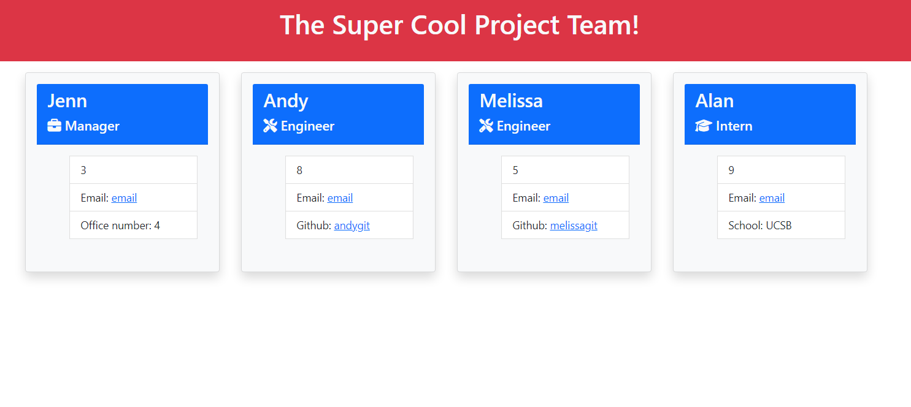

  # Team Site Generator <a href="https://opensource.org/licenses/MIT"></a>

## Description

This project is a command line application that dynamically generates a homepage for a project team based on user input. 

The walkthrough video can be found [here](https://www.youtube.com/watch?v=tev6qnnt-XQ)
****

## Table of Contents
* [Installation](#installation)
* [Usage](#usage)
* [License](#license)
* [Contributing](#contributing)
* [Tests](#tests)
* [Questions](#questions)

****
## Installation

To generate a team site using this application, clone down this repository to a local file. To install the required external packages Inquirer v 8.2.4 and Jest v 24.8.0, run:

```md
npm i
```

****
## Usage



Run the application using `node index.js`, then fill out the prompts. When finished, your site will be generated in the dist directory, titled with the user's entered project name.

****
## License

Please refer to the license <a href="https://opensource.org/licenses/MIT">here</a>

****
## Contributing

Not applicable to this project.

****
## Tests

To run the tests, enter:
```md
npm run test
```

****
## Questions

If you have any questions regarding this project, please email me <a href="mailto:email">here!</a>
Visit my <a href="https://www.github.com/jennnmarshall">Github profile!</a>